##Consistency in distributed systems (data)

###[Wireframes](https://whimsical.com/consistency-DH3e3YxaJ4PFkTCadcSv5f) 

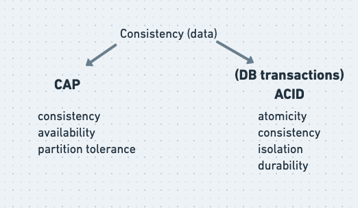

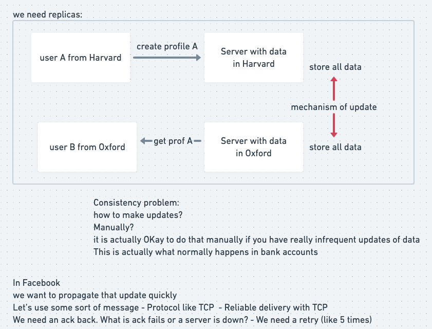

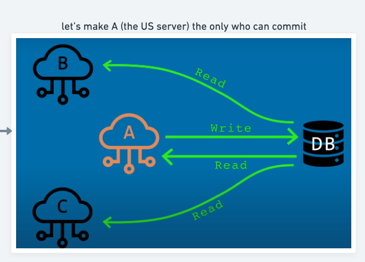

It's all about tradeoffs

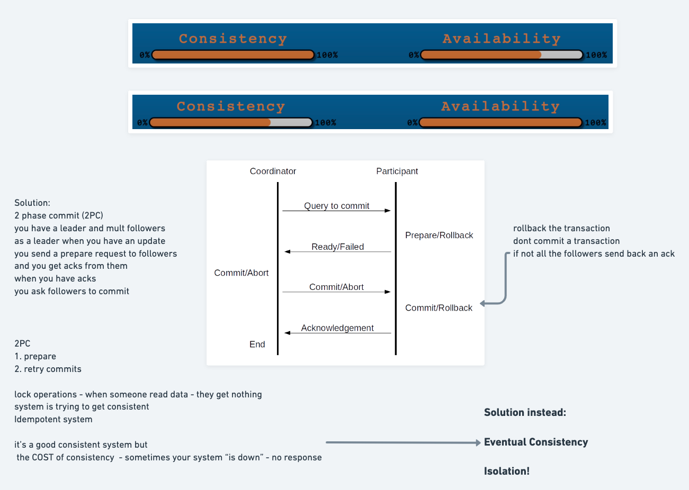

CAP theorem - only 2 of 3 is possible 
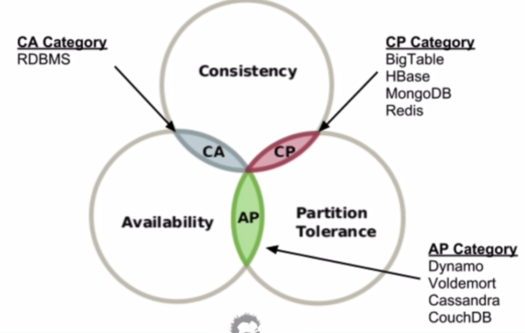

Eventually Consistent

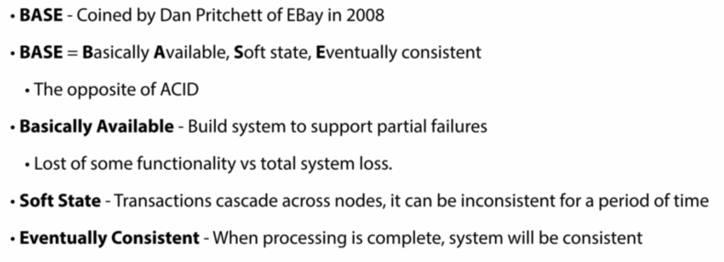

Saga definition

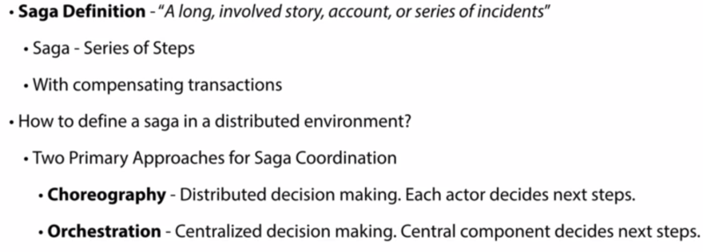

Choreography Coordination 

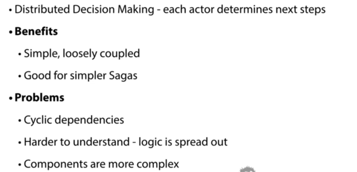

Choreography Implementation
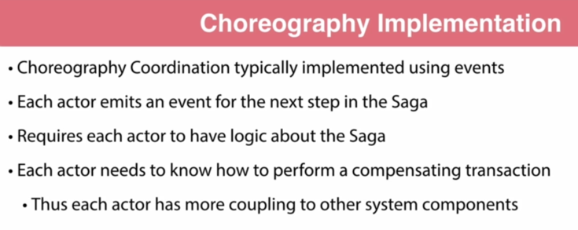

Orchestration Coordination
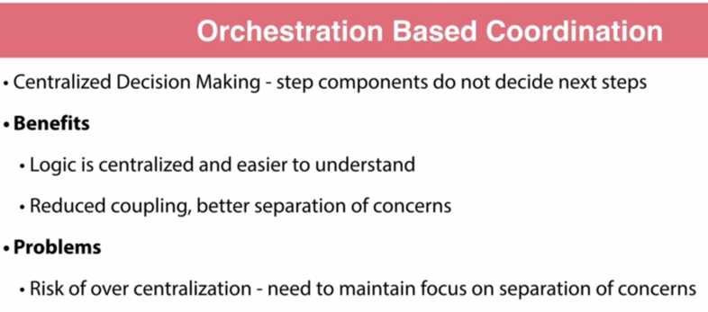

Orchestration Implementation

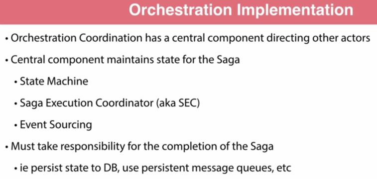

Which to use?

