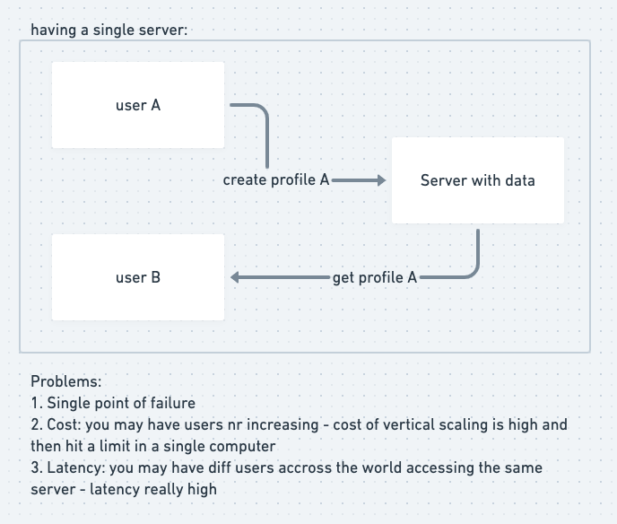
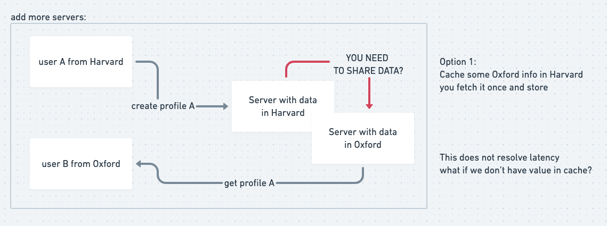
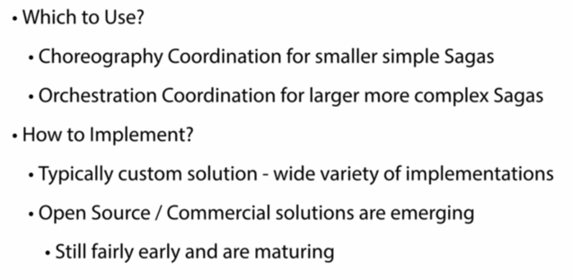

##Consistency in distributed systems (data)

###[Wireframes](https://whimsical.com/consistency-DH3e3YxaJ4PFkTCadcSv5f) 

It's all about tradeoffs

CAP theorem - only 2 of 3 is possible 

Eventually Consistent

Saga definition

Choreography Coordination 

Choreography Implementation

Orchestration Coordination

Orchestration Implementation

Which to use?

