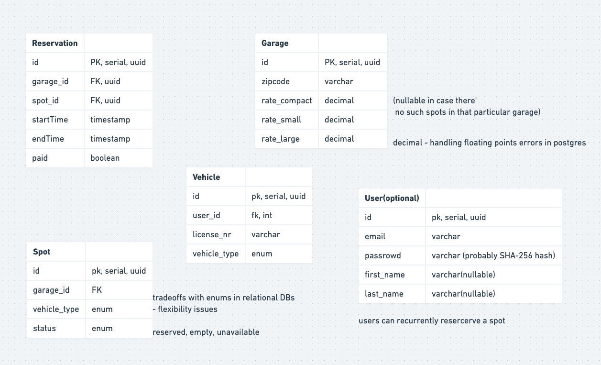
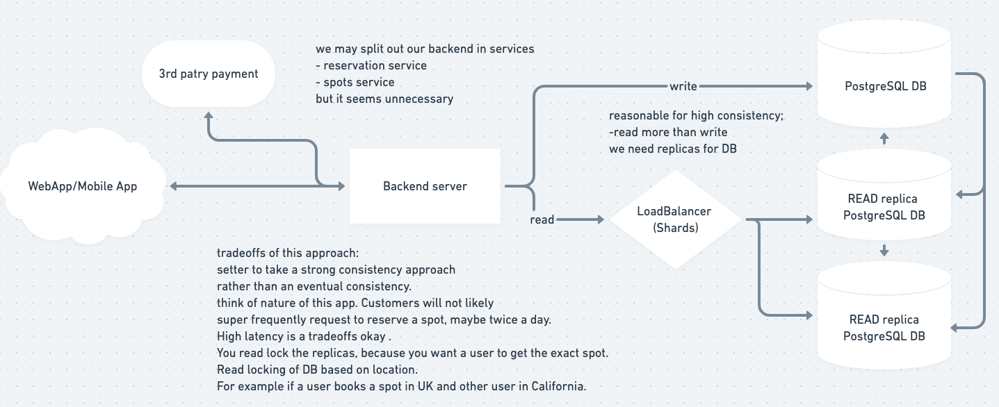

###**Clarify the requirements:** 
1. reserve a spot
2. ticket / receipt 
3. pay 
4. scale requirement
5. higher consistency (don't want 2 people to reserve 1 slot)
6. different types of parking?? - 3 types (size of vehicle) - compact, regular, large
7. prices - flat rate - diff rates for diff sizes of cars and type of parking
8. interface + backend server 

Define an interface (API we're working with)

some public endpoints and some internal endpoints 

###**Public endpoints:** 

>/reserve
- Params - garage_id, start_time, end_time
- Returns - (spot_id, reservation_id)

>/payment (3rd patry handling them)
- Params: reservation_id

>/cancel (cancel a reservation)
- Params (resrvation_id) 

###**Internal endpoints:** 

>/calculate_payment

- Param: reservation_id

>/free_spots
- Param: garage_id, vehicle_type, time
(Note: smaller vehicles may fir into bigger spots, but we don't allow that once thre're still some smaller places available)

>/allocate_spot
 - Param: garage_id, vehicle_type, time

Some details:
- ability to create an account might be reasonable, e.g. we use a garage over and over
>/ create_account
- Params: email, password(optinal), first_name, last_name
- 3rd party - sso like google
>/login 
- Params: email, password

------------------------------------------------------------------------------------

###Scale: 
we want high consistency 
size: per garage (10 floors) 200 spots per spot - 2000 spots per garage 
system - NOT a distributed system , NOT a big data

we dont waht to have a race condition 
not many scale issues 

------------------------------------------------------------------------------------
###Data schema 

tend to lean towards relational databases for most of this types of problems 
reasonable speaking, postgres or mysql will work here 

[see](**https://whimsical.com/garage-5TFcAJ7iGTd9wKRjUJJcBv**): https://whimsical.com/garage-5TFcAJ7iGTd9wKRjUJJcBv 

